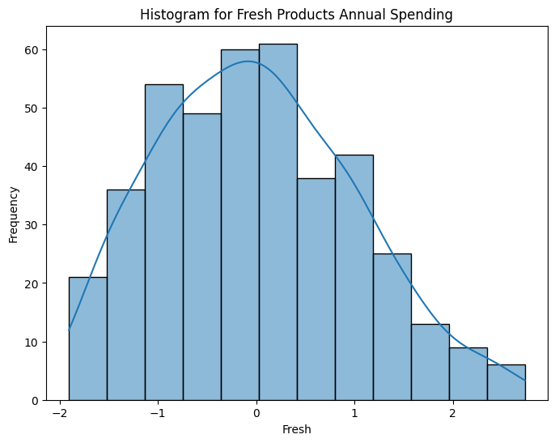
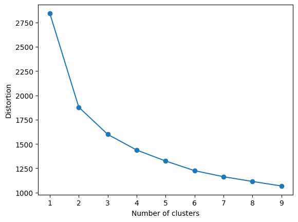
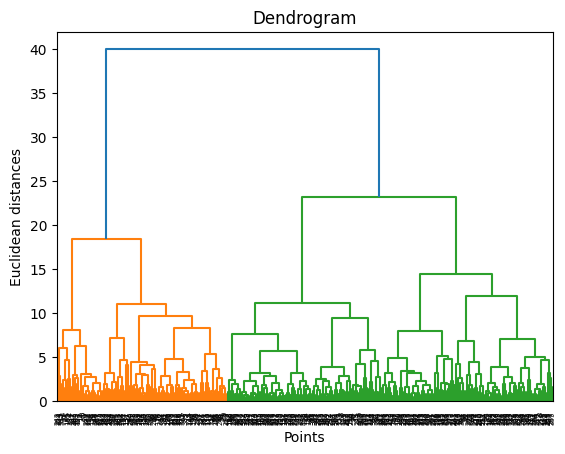
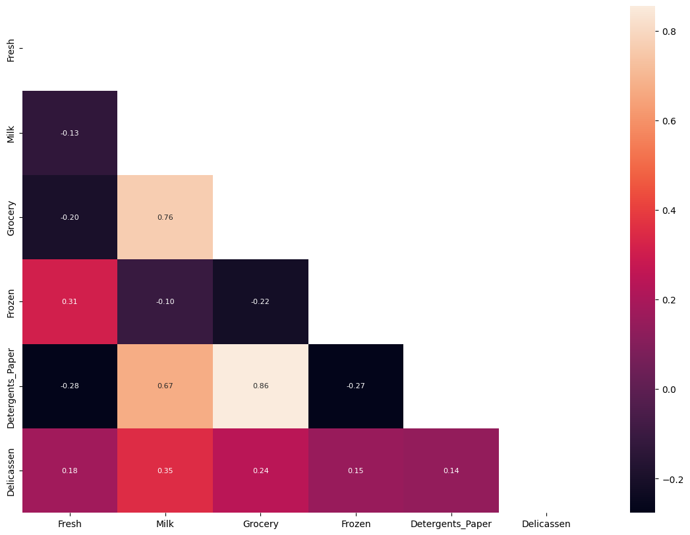
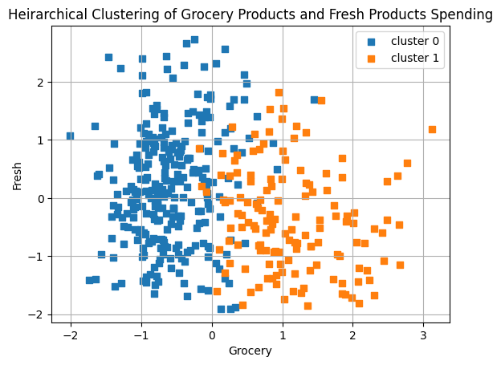
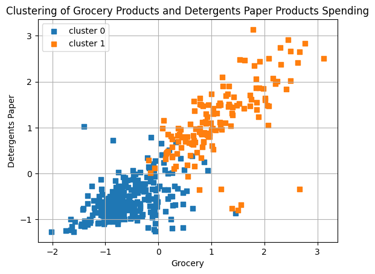
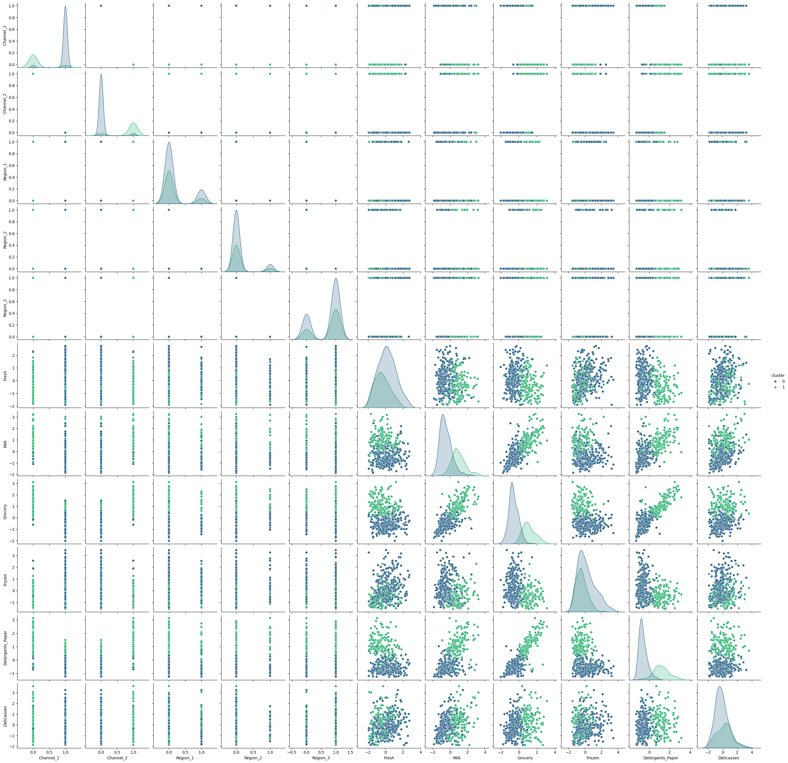

# LHL Data Science Bootcamp Unsupervised Learning Project

## Project Outcomes
Perform unsupervised learning techniques on a wholesale data dataset. The project involves four main parts: exploratory data analysis and pre-processing, KMeans clustering, hierarchical clustering, and PCA.

### Project Description:
In this project, we will apply unsupervised learning techniques to the wholesale data set and use data visualization tools to communicate the insights gained from the analysis.

The dataset contains information about various products sold by a grocery store.

### Process: 
1. Exploratory data analysis and pre-processing: 
    - Parsing through and understanding data
    - Checking for missing values, removing outliers, scaling and transforming data to avoid biases in models. 
    - Creating visualizations to understand relationships of variables.

        Original Data               |  Cleaned Data
        :-------------------------:|:-------------------------:
          |  
             
2. KMeans Clustering
    - Determining optimal clusters with elbow rule 
    - Fitting transformed data to SKLearns SKMeans Model

    
      
3. Hierachical Clustering
    - Determining optimal clusters using dendogram
    - Fitting transformed data to SKLearns Agglomerative Clustering

    
      
4. PCA 
    - Determining optimal components using cumulative variance ratio
    - Fitting transformed data to SKLearns PCA Model
    
## Results
- Optimal number of groups to categorize data was determined to be 2 from the different unsupervised learning models.
- Detergent Paper, Milk, and Grocery share a high correlation and were grouped similarly in the models

- The clustering from the KMeans and Hierachical clustering models produce very similar results

- Multiple features contribute to the seperation of these groups, but the following are some of the the features that differentiate the two. 
    - Cluster 0 tends to spend less on grocery products and more on frozen products
    - Cluster 1 tends to spend more on grocery products and less on frozen products

        KMeans Model               |  Heirarchical Model
        :-------------------------:|:-------------------------:
          |  

    - cluster 1 spends more on detergents paper products where as clust 0 spends much less
        

    - Cluster 0 was spents more on Milk, Grocery, and Detergents, where cluster 2 spend more of Deli and Fresh products

## Future Goals
The above results provide initial interpretation of the data. Much more insight can be made from the data depending on different objectives in analysing the data further. 
- Further Analysis of the data for the different features
- Additional interpretations of components from PCA model

